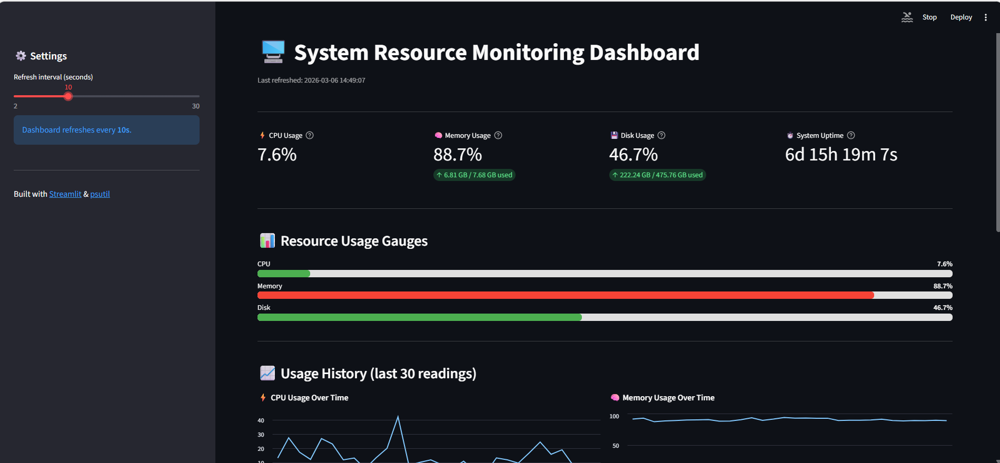

# System Resource Monitoring Dashboard

A real-time system monitoring dashboard built using **Python, Streamlit, and psutil**.
The dashboard displays key system metrics such as **CPU usage, memory utilization, disk usage, and system uptime** through an interactive web interface.

This project demonstrates basic **system monitoring and observability concepts** used in DevOps and infrastructure environments.

---

## Live Demo

[Open Live Dashboard](https://system-resource-monitoring-dashboard.streamlit.app/)

---

## Features

* Real-time CPU usage monitoring
* Memory utilization tracking
* Disk usage visualization
* System uptime monitoring
* Auto-refresh dashboard with adjustable refresh interval
* Historical charts showing CPU and memory usage trends
* Detailed system statistics including CPU cores, RAM usage, and disk space

---

## Technologies Used

* **Python**
* **Streamlit**
* **psutil**
* **pandas**
* **Git & GitHub**

---

## Installation

Clone the repository:

```
git clone https://github.com/Ankit-codes87/system-resource-monitoring-dashboard.git
```

Navigate to the project directory:

```
cd system-resource-monitoring-dashboard
```

Install dependencies:

```
pip install -r requirements.txt
```

Run the application:

```
streamlit run app.py
```

The dashboard will open in your browser at:

```
http://localhost:8501
```

---

## Dashboard Preview



---

## Project Structure

```
system-resource-monitoring-dashboard
│
├── app.py
├── requirements.txt
├── README.md
└── dashboard.png
```

---

## Future Improvements

* Add alert notifications when CPU or memory usage exceeds a threshold
* Add network monitoring metrics (bandwidth usage)
* Store historical system metrics for long-term analysis
* Export system metrics as logs or reports

---

## Author

**Ankit Kumar**

GitHub: https://github.com/Ankit-codes87
